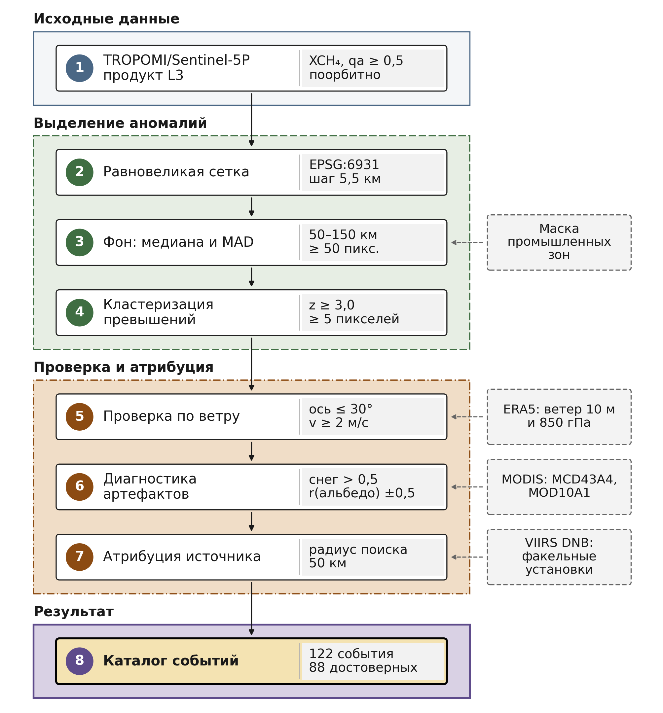

# Detection methodology

[Русская версия](METHODS.ru.md)

This document describes how the 122-event catalogue was produced: source data, anomaly computation, thresholds, classification, cross-checking against independent sources and sensitivity checks. Every numeric parameter is given with the value used to build the published catalogue.



*Figure 1. Structure of the detection method. The sections below expand the steps of the diagram; vector version — [`figures/fig1_pipeline_300dpi.svg`](figures/fig1_pipeline_300dpi.svg), full caption — [`figures/CAPTIONS.en.md`](figures/CAPTIONS.en.md), script — [`code/py/figures/bake_pipeline.py`](code/py/figures/bake_pipeline.py).*

---

## 1. Source data

| Purpose | Dataset | Selection |
|---|---|---|
| Methane concentration | `COPERNICUS/S5P/OFFL/L3_CH4` (TROPOMI/Sentinel-5P) | `qa_value ≥ 0.5` |
| Wind fields | `ECMWF/ERA5/HOURLY`, ERA5 hourly reanalysis | 10 m is the primary level; 850 hPa only feeds a quality-control flag (§4.1) |
| Artefact diagnostics | MODIS collection 6.1: `MODIS/061/MCD43A4` (reflectance) and `MODIS/061/MOD10A1` (snow cover) | §5 |
| Industrial objects and flares | project registry: oil and gas fields, thermal power plants, VIIRS Day/Night Band bright night-time sources | §4.2 |

The L3 product grid is 0.01° (1113.2 m along the meridian). Computations run in the Lambert azimuthal equal-area projection for the northern hemisphere, **EPSG:6931**, on two grids:

| Stage | Grid step |
|---|---|
| Annulus background, MAD and z-score (§3.1–3.2); the annulus is defined on the same grid | **5.5 km** |
| Cluster extraction, outlines, area and per-cluster pixel statistics (`max_z`, `mean_z`, enhancements, `n_pixels`) (§3.3, §4) | **7 km** — the analysis grid (`ANALYSIS_SCALE_M = 7000`) |

An analysis-grid pixel is nominally 7 × 7 = 49 km²; Earth Engine measures the outline area at 48.5–48.9 km² per pixel, so the smallest 5-pixel cluster covers about 243 km² (the catalogue minimum is 243.1 km²). An equal-area projection is needed because the region spans 50–74°N, where area distortion in geographic coordinates is substantial.

⚠️ Caveat from the data provider's catalogue: filtering on `qa_value` does not remove all problematic pixels; some pixels with too low methane concentrations remain.

---

## 2. Area and period

**Area of interest** — the West Siberian Plain within its physico-geographic boundary. The published layer `data/zapsib_boundary.geojson` is a multipolygon of 8 non-overlapping parts (the main one 2.913 million km², seven small ones from 58 to 1,985 km²), 37,884 coordinate positions (37,876 without the positions that close the rings), with no interior rings. Its area in the Lambert azimuthal equal-area projection EPSG:6931 is **2.918 million km²** (a geodesic computation on the WGS 84 ellipsoid gives the same), which is 58.5% of the 60–95°E × 50–75°N bounding box used at earlier stages of the work. The 2.90 million km² quoted in the paper, in the README and in the layer's `area_km2` attribute (2,901,540 km²) is the area on a sphere of radius 6371 km, as Google Earth Engine computes it; the same computation on the published layer gives 2,901,541 km².

The layer was produced by dissolving the original Earth Engine asset, which held 8 features and 45,386 coordinate positions; the dissolve removed the internal division lines (the layer's `geometry_note` attribute).

The boundary was digitised manually by the author (Sizov, 2026) from a digital elevation model, guided by the boundaries given in the *Atlas of Tyumen Oblast* (1971) and other cartographic atlases. The vector layer is published alongside the catalogue, so the area is reproducible exactly, without re-digitisation.

> Sizov O.S., Geomorphological zoning of the West Siberian Plain based on the AW3D30 digital elevation model, *Geomorfologiya i paleogeografiya*, 2026, V. 57, No. 1, pp. 97–116 (in Russian).

**Period** — 2019–2025, March through October. Winter months are excluded by an objective constraint: XCH₄ retrieval is unavailable at high latitudes under low sun and persistent snow cover.

---

## 3. Anomaly computation

The governing principle: **an anomaly is defined relative to the local background within the same orbital overpass**, not by an absolute concentration threshold and not from multi-month composites. Composites smooth away the short-lived enhancements the search targets, and a single absolute threshold ignores the latitudinal and seasonal march of the background.

**Latitude-band correction.** Before the background is estimated, each pixel of the orbit has its persistent deviation subtracted: the median of that pixel over all orbits within ±7 days minus the median of such medians across its 0.5°-wide latitude band (band statistics are taken over the processing area at 7 km scale). Deviations that persist for two weeks — retrieval stripes and patches — are removed, while a short-lived plume barely enters the two-week median and is preserved.

### 3.1. Local annulus

For each pixel the background is estimated over an annular neighbourhood, using the pixels that lie inside infrastructure buffer zones (the `industrial_buffers` reference, see §3.4). The annulus is defined on the 5.5 km grid: it contains the pixels whose centres lie 50–150 km from the central pixel.

| Parameter | Value |
|---|---|
| Inner radius | 50 km |
| Outer radius | 150 km |
| Minimum pixels in the annulus | 50 |

The 50 km inner radius keeps the plume itself out of its own background. If fewer than 50 valid pixels fall in the annulus, the z-score for that pixel is masked — the background estimate is treated as unreliable.

### 3.2. Robust z-score

Background level and spread are estimated with robust statistics — the **median and the median absolute deviation (MAD)** rather than the mean and standard deviation. Robust estimators are not dragged by a plume that falls inside the neighbourhood.

```
Δ = XCH4(pixel) − median(annulus)
z = Δ / (1.4826 · MAD(annulus))
```

The factor 1.4826 scales MAD to standard-deviation units for a normal distribution.

The published configuration sets no lower bound on MAD (`mad_floor_ppb = 0`): if nearly all annulus values are identical (MAD ≈ 0), the z-score grows without bound. In the run of §8.2 two such "degenerate" annuli produced z = 165.8 and 8898.3.

### 3.3. Thresholds

| Parameter | Value | Meaning |
|---|---|---|
| `z_min` | **3.0** | minimum pixel z-score |
| `min_cluster_px` | **5** | minimum connected-cluster size, in 7 km analysis-grid pixels |
| `connectedness` | **8** | cluster pixels connect by side or by corner |

⚠️ The z ≥ 3.0 threshold is an **operating threshold set empirically**. It is not a significance level: the residual distribution was not tested for normality, and no probabilistic interpretation applies.

### 3.4. Masking

Two conditions are applied. The first is retrieval validity at the orbit level. The second sets the **background reference** and, with it, the search area: both the annulus sample and the candidates are confined to infrastructure buffer zones by type — oil and gas fields 50 km, high-confidence flares 30 km, low-confidence flares 15 km, thermal power plants and other objects 30 km. This is the configuration parameter `background.annulus_reference = industrial_buffers` (Algorithm §3.6.2); the alternative reference `regional_clean` — the annulus over clean pixels with an explicit buffer filter on candidates — is kept for comparisons and for other gases. The industrial reference is a measured choice: in summer the clean surroundings of the fields are wetlands with systematically higher methane (the clean-ring median sits 4–9 ppb above the industrial-ring median at the published events), and with the regional reference the detector fires over the nature reserves on 84 of 1,064 overpasses (82 of 1,062 without two degenerate annuli; §8.2).

No separate wetland or water masks are applied: wetlands are kept out of the background by the choice of reference itself (they do not fall inside infrastructure buffers), and water is already removed by the product's native quality control.

---

## 4. Event characteristics

Connected clusters of pixels passing the thresholds form events. For each, the following are computed:

- **Geometry** — centroid and area of the cluster outline (7 km analysis grid, §1), pixel count, major-axis orientation (eigen-decomposition with a cosine-latitude correction)
- **Signal strength** — maximum and mean z-score, maximum and mean enhancement over background in ppb
- **Wind conditions** — §4.1
- **Source** — category, distance, registry identifier (§4.2)

### 4.1. Wind

Wind comes from the ERA5 hourly reanalysis (`ECMWF/ERA5/HOURLY`): the u and v components are vector-averaged over a ±3 h window around the overpass time and sampled at the cluster centroid (sampling scale 27.83 km, about 0.25°). The primary level is 10 m: speed, direction and wind components are recorded from it (`wind_level = 10m` in every record).

| Condition | Value | Result |
|---|---|---|
| angle between the cluster axis and the 10 m wind direction, at a speed ≥ 2 m/s | ≤ 30° | `aligned`, `wind_consistent = 1` |
| same | > 30° | `misaligned`, `wind_consistent = 0` |
| 10 m wind speed | < 2 m/s | `insufficient_wind`: agreement not assessed, `wind_consistent` empty |
| difference between the 10 m and 850 hPa wind directions | > 45° | flag `wind_levels_inconsistent_qa = 1`; does not affect the event category |

The agreement score is `wind_alignment_score = 1 − Δθ/90`, where Δθ is the angle (0–90°) between the cluster axis and the wind direction; the 30° threshold corresponds to 0.667. In the catalogue: `aligned` — 34 events, `misaligned` — 79, `insufficient_wind` — 9; the level-disagreement flag is set on 43 events.

The 850 hPa level is used only for that flag. The run parameter snapshot from which `params_hash` is computed still carries the key `wind.level_hpa = 850` from an earlier revision in which 850 hPa was the primary level; the wind-check function does not read that key — the primary level is set inside the function (10 m), as the `wind_level` and `wind_source` fields record.

### 4.2. Source attribution

Each event is assigned one object from the project's industrial-object registry. The search covers a 50 km radius around the cluster centroid; among the objects found, the one with the highest-priority category is chosen, and among equal priorities the nearest one. The `nearest_source_*` fields therefore describe the **assigned** object: an object of another category may lie closer to the event.

| Priority | Category | Registry objects | Mask buffer (§3.4) |
|---|---|---|---|
| 1 | `gas_field` | oil and gas fields (oil and gas fields are not separated) | 50 km |
| 2 | `viirs_flare_high` | high-confidence flares: radiance ≥ 100 nW/(cm²·sr) | 30 km |
| 3 | `coal_mine` | coal mining | 30 km |
| 4 | `tpp_gres` | thermal power plants (hydro and nuclear excluded) | 30 km |
| 5 | `viirs_flare_low` | low-confidence flares: radiance < 100 nW/(cm²·sr) | 15 km |
| 6 | `smelter` | metallurgy | 30 km |

Four categories occur in the catalogue: `viirs_flare_high` — 89 events, `gas_field` — 25, `viirs_flare_low` — 7, `tpp_gres` — 1; the distance to the assigned object ranges from 1.1 to 49.2 km.

**The registry and its open sources.** The registry is stored in the Earth Engine asset `RuPlumeScan/industrial/source_points` and is not part of this repository.

- **Flares** — 474 points of bright night-time sources from the 2022–2024 median composite of the VIIRS Day/Night Band (`NOAA/VIIRS/DNB/MONTHLY_V1/VCMSLCFG`, Earth Engine catalogue): connected areas with radiance of at least 50 nW/(cm²·sr) outside built-up land (MODIS `MODIS/061/MCD12Q1`, class 13, with a 5 km buffer), one point per area. Confidence follows the composite radiance at the point: at least 100 nW/(cm²·sr) — high (168 points), below that — low (306 points).
- **Thermal power plants** — the Global Power Plant Database (WRI, `WRI/GPPD/power_plants`) and OpenStreetMap.
- **Fields** — points entered manually by the author, and OpenStreetMap objects.
- **Coal mining and metallurgy** — manually entered points and OpenStreetMap; no events of these categories fall inside the plain.

---

## 5. Artefact classification

Some XCH₄ anomalies arise not from emissions but from retrieval behaviour over bright or dark surfaces. The rule is:

```
artifact_likely = (corr_albedo ≥ +0.5) OR (snow fraction in cluster > 0.5)
```

- `corr_albedo` is the Pearson correlation between the z-score and surface reflectance across the cluster pixels (5.5 km scale). Reflectance is MODIS MCD43A4 v6.1 (`MODIS/061/MCD43A4`, SWIR band `Nadir_Reflectance_Band6`, 1628–1652 nm), averaged over ±8 days around the overpass. A positive correlation indicates a bright-surface artefact.
- The snow fraction is the share of the cluster area where MODIS MOD10A1 v6.1 snow cover (`MODIS/061/MOD10A1`, `NDSI_Snow_Cover`, averaged over ±1 day around the overpass) exceeds 50; it is computed at 500 m scale.

The converse case, `corr_albedo ≤ −0.5`, is flagged as `surface_confounded_dark` — an **annotation, not a rejection**: the event stays in the catalogue.

Result: **88 valid, 34 likely artefacts** out of 122.

The rule was applied uniformly across all years. Some records carry a stale algorithm-version label, but a per-event check confirms the processing is uniform: the earlier, symmetric form of the rule (`|corr_albedo| ≥ 0.5`) would have produced 47 artefacts, whereas 34 are observed — exactly what the directional form yields.

---

## 6. Event category

A five-level priority cascade:

| Priority | Condition | Category |
|---|---|---|
| 1 | centroid inside a nature reserve used as a clean zone (`inside_reference_clean_zone`) | `diffuse_CH4` |
| 2 | wetland heuristic: ≥ 3 of 4 conditions met¹ | `diffuse_CH4` |
| 3 | the cluster axis disagrees with the 10 m wind (`wind_state = misaligned`, §4.1) | `wind_ambiguous` |
| 4 | a source is found within 50 km (§4.2) and the wind agrees or was not assessed | `CH4_only` |
| 5 | otherwise (no source within 50 km) | `wind_ambiguous` |

¹ The four conditions are: area above 1000 km²; low cluster compactness; months June–September; no industrial source within 100 km (with a 50 km search radius this means no source was found within the search radius). The compactness threshold has not been calibrated empirically, so in the applied configuration that condition is always false and the remaining three must all hold — making the diffuse classification deliberately conservative.

Observed distribution: `wind_ambiguous` — 78 (all with `wind_state = misaligned`), `CH4_only` — 43 (34 `aligned` and 9 `insufficient_wind`), `diffuse_CH4` — 1 (the event inside a reserve). The 10 m/850 hPa level-disagreement flag does not affect the category: among others, it is set on 16 `CH4_only` events.

---

## 7. Cross-check against independent catalogues

An event counts as matched if an independent catalogue reports a detection **from the same year** within **150 km**. The condition is simultaneously spatial and temporal — a coordinate match without a year match does not count.

Both catalogues are first clipped by the same physico-geographic boundary so the comparison is symmetric:

| Catalogue | Total in bounding box | Inside the plain |
|---|---|---|
| Schuit et al. (2023) | 123 | 32 |
| UNEP IMEO MARS | 446 | 163 |

### Results

**Tier 1 — Schuit et al. (2023)**

| Metric | Value |
|---|---|
| Precision | 43.8% (7 of 16) |
| Recall | 46.9% (15 of 32) |

**Tier 2 — UNEP IMEO MARS**, for years with non-empty coverage:

| Year | Precision |
|---|---|
| 2023 | 57.1% (12 of 21) |
| 2024 | 82.1% (32 of 39) |
| 2025 | 64.3% (9 of 14) |
| **2023–2025** | **71.6% (53 of 74)** |

2022 is excluded entirely: no MARS record falls inside the plain that year, so the seven 2022 catalogue events are excluded from the combined denominator as well (21 + 39 + 14 = 74). Correction of 2026-08-27: the previously published figure of 65.4% (53 of 81) counted the 2022 events in the denominator despite the declared exclusion.

Confidence intervals and the number of MARS detections per year are in [`data/tables/`](data/tables/README.en.md).

### How to read this

⚠️ **The independent catalogues are not ground truth.** Both target large gas-field sources and systematically omit flaring.

Of the 122 events, **62 have no match** in either catalogue. Of those:

| Class | Count | Reason |
|---|---|---|
| Outside temporal coverage | 32 | 2019, 2020, 2022 — no records of the matching year inside the plain |
| No spatial match | 30 | records exist, but none within 150 km |

**44 of the 62 unmatched events are attributed to flares** of the registry (§4.2) at the detection stage. The unmatched fraction therefore reflects **complementary coverage**, not a false-positive rate.

The median distance between matched pairs — from an event to the nearest same-year independent-catalogue detection within 150 km — is **77.5 km** over 60 pairs; Tier 1 — 86.3 km (7 pairs), Tier 2 — 76.5 km (53 pairs). The numbers are in [`data/p_02_0d_match_curves.json`](data/p_02_0d_match_curves.json), field `median_nn_matched_150km`.

**Methodological note on active-fire products.** Active-fire products (VNP14A1, FIRMS) are wildfire thermal-anomaly detectors that systematically miss steady gas flaring — the very reason VIIRS Nightfire was developed. Post-hoc matching against active-fire products yielded corroboration rates anywhere from 17% to 73% depending purely on buffer and time-window choice, which reflects a product–task mismatch rather than the reality of flaring. Flare attribution is done at the detection stage from the flare registry (§4.2), not from active-fire products.

---

## 8. Sensitivity and false-alarm checks

Both checks ran in Google Earth Engine; their outputs are published in `data/`, and the summary rates in [`data/tables/table3_detection_probabilities.csv`](data/tables/table3_detection_probabilities.csv). All intervals are 95% Wilson intervals.

### 8.1. Synthetic injections

Script [`code/py/analysis/step8b_synthetic_pod.py`](code/py/analysis/step8b_synthetic_pod.py); output [`data/p_02_0e_synthetic_pod.json`](data/p_02_0e_synthetic_pod.json) (one record per injection plus a summary).

- **Sites.** 30 sites — a random sample (seed 20260514) of the industrial-object registry within the 60–95°E × 50–75°N box; 29 of the 30 lie inside the plain.
- **Injection.** The nominal flux is uniform over 1–10 t/h. The injection is a 15 km-radius disc with a constant enhancement of 8 ppb per 1 t/h (a test scale, not a physical calibration). The disc is added to the data without lifting the native mask: where there is no retrieval, there is no injection either.
- **Data.** A mosaic of TROPOMI L3 orbits for 10–19 July 2024 within ±200 km of the site.
- **Detector** — as in the catalogue build (`industrial_buffers` reference, z ≥ 3, ≥ 5 pixels, 8-connectivity, clusters on the 7 km grid), but without the latitude-band correction.
- **Paired design.** Each site is run twice on the same input — without and with the injection. A recovery is a cluster of the injected run whose centroid lies within 50 km of the site and has no control-run cluster within 10 km.
- **Coverage** — the number of valid L3 pixels (0.01° grid) in the 15 km disc, field `n_valid_px_disk`. "Valid data at the site" means at least one valid 7 km-grid pixel in the same disc.

| Condition | Recovered | Rate | 95% interval |
|---|---|---|---|
| All injections | 10 of 30 | 0.33 | 0.19–0.51 |
| Valid data at the site | 10 of 24 | 0.42 | 0.25–0.61 |
| Coverage ≥ 200 pixels in the disc | 10 of 17 | 0.59 | 0.36–0.78 |
| — of these, flux > 6 t/h | 8 of 8 | 1.00 | 0.68–1.00 |
| Miss (all injections) | 20 of 30 | 0.67 | 0.49–0.81 |

None of the 13 injections with fewer than 200 pixels of coverage was recovered (six of them had no valid pixel in the disc at all). Thirteen injections had a flux above 6 t/h: 8 were recovered, all of them with sufficient coverage. The smallest recovered flux is 2.63 t/h. The 200-pixel coverage threshold was applied when analysing the results (the file's summary does not contain it); the rates are recomputed from the `n_valid_px_disk` field.

⚠️ The nominal intensities are a test scale: they must not be equated with actual fluxes or taken as an estimate of the detection limit.

### 8.2. Nature-reserve run

Script [`code/py/analysis/step8f_clean_zone_false_alarms.py`](code/py/analysis/step8f_clean_zone_false_alarms.py); output [`data/p_02_0e_clean_zone_false_alarms.json`](data/p_02_0e_clean_zone_false_alarms.json) (one row per trial, grouped by reserve and month).

In the published configuration the z-score exists only inside infrastructure buffers (§3.4), so a detection over the reserves is nearly impossible by construction: the Yugansky reserve lies 15% inside the buffers, the Verkhne-Tazovsky reserve 0%. To characterise the anomaly extraction itself over a wetland background, the detector was run over these reserves in a different configuration:

- an annulus of clean pixels outside the buffers (`regional_clean` reference);
- candidates not restricted to the buffers;
- the artefact-diagnostic cascade (§5) not applied;
- no lower bound on MAD.

Everything else is as in the catalogue build: latitude-band correction (over the reserve's ±200 km neighbourhood rather than the whole area), z ≥ 3, cluster ≥ 5 pixels, 8-connectivity.

- **Trial** — a "reserve × orbit" pair with at least five valid retrievals inside the reserve (7 km grid), March–October 2019–2025.
- **Alarm** — at least one pixel of a significant cluster inside the reserve.

| Sample | Trials | Alarms | Rate | 95% interval |
|---|---|---|---|---|
| All trials | 1064 | 84 | 7.9% | 6.4–9.7% |
| Without the two degenerate annuli | 1062 | 82 | 7.7% | 6.3–9.5% |

Both degenerate annuli (MAD ≈ 0) fall in September 2022:

- Yugansky reserve, 16.09.2022, maximum z = 165.8;
- Verkhne-Tazovsky reserve, 29.09.2022, maximum z = 8898.3.

By reserve: Yugansky — 35 of 462 trials (7.6%), Verkhne-Tazovsky — 49 of 602 (8.1%). The rate is highest in September (20 of 137, 15%) and October (4 of 38, 11%); March–August — 4–8%. Among the 82 alarms without the degenerate annuli, the median maximum z-score is 4.6, and 28 have z > 5.

⚠️ This is a candidate-stage rate, before artefact diagnostics, i.e. an upper estimate. For the published configuration no such rate is defined, because the z-score is not computed outside the buffers.

---

## 9. Computational cost

Building the seven-year catalogue required **approximately 400 EECU-hours** in Google Earth Engine. This is an order-of-magnitude estimate: per-task accounting was not maintained.

---

## 10. What the methodology does not include

- **Mass flow rate estimates** (t/h, kg/h) are not computed
- **Machine learning** is not used at any stage
- **Composites** (monthly or annual medians with a threshold) are not used for detection
- **A single absolute concentration threshold** is not applied — only enhancement over the local background
